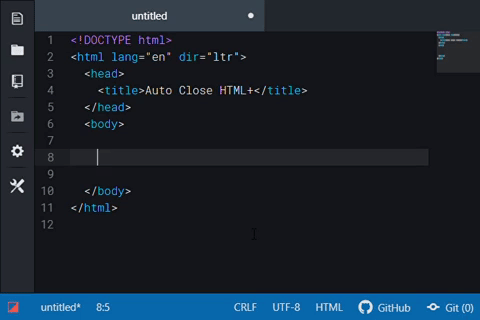

# Auto Close HTML+

Will automatically add closing tags when you complete the opening tag.

This is forked from the [Auto Close HTML package](https://atom.io/packages/autoclose-html) which is no longer being maintained.



> Other packages used in the above screen: [Threshold UI](https://atom.io/themes/threshold-ui), [Convergent Syntax](https://atom.io/themes/convergent-syntax), [Tool Bar](https://atom.io/packages/tool-bar) with [Flex Tool Bar](https://atom.io/packages/flex-tool-bar), and [Minimap](https://atom.io/packages/minimap)

## Installation

### In Atom

1. Go to `File > Settings`
1. Click "+ Install"
1. Search for "autoclose-html-plus"
1. On "autoclose-html-plus", click the "Install" button

### Command line

```
apm install autoclose-html-plus
```

## Usage

Under normal circumstances ending tags will be inserted on the same line for inline elements and with `\n\t\n` in between for block elements. This is determined by attaching an element of the given type to the window and checking its calculated `display` value.

You can use Force Inline and Force Block preferences to override this.

## Bug Reports and Contributing

If you find a bug, please feel free to file an issue, and/or try fixing it yourself and submitting a PR.

## Options

### Force Inline

Elements in this comma delimited list will render their closing tags on the same line, even if they are block by default. You can set this to "\*" to force all closing tags to render inline.

### Force Block

Elements in this comma delimited list will render their closing tags after a tabbed line, even if they are inline by default. A value of "\*" for Force Inline overrides all values in Force Block.

### Never Close

Elements in this comma delimited list should *not* render a closing tag

### Make Never Close Elements Self Closing

Will convert elements in Never Close list from `<tag>` to `<tag />`

### Legacy/International Mode

Enables the old style of completion detection using buffer events rather than keybindings. Atom doesn't work well currently with non-US/non-QWERTY keyboards and will not correctly fire events when '>' is pressed and/or fire events for entirely different keys.  **Please note that this mode is buggy (i.e. can complete after undo) and may not be compatible with new features and bug fixes in future releases, post-0.22.0** If/when the core issues behind keybindings not reporting correctly on international keyboards is solved this option will be removed.


## Changelog

#### 0.27.0
- Tags broken over lines now autoclose

#### 0.26.0
- Add option for unrecognised tags (e.g. custom XML tags) to be made block tags (enabled by default)

#### 0.25.0 (forked from [autoclose-html](https://atom.io/packages/autoclose-html))
- Add support for XML and markdown files
- Allow backtracking from automatic block tag to inline with single undo / Ctrl+Z

#### 0.24.0
- Stopped self closing tags from auto closing

#### 0.23.0
- Added legacy mode for users having problems with event handling introduced in 0.22.0

#### 0.22.0
- Better way of handling events, solves rebinding problems **and** having to define grammars to apply to

#### 0.21.0
- Fixed double closing after changing grammar

#### 0.20.0
- HTML (Jinja Templates), Ember HTMLBars, JavaScript with JSX added to default grammars, per user requests
- Dispose events on deactivate (should prevent double closing after an upgrade in the future, although I don't think it will help for this release)
- Added ability to use "\*" for Force Inline Options
- Some Readme cleanup
